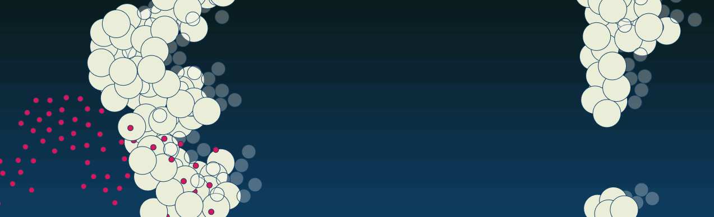

<!--
**codeswitchstudio/codeswitchstudio** is a ✨ _special_ ✨ repository because its `README.md` (this file) appears on your GitHub profile.

Here are some ideas to get you started:

- 🔭 I’m currently working on ...
- 🌱 I’m currently learning ...
- 👯 I’m looking to collaborate on ...
- 🤔 I’m looking for help with ...
- 💬 Ask me about ...
- 📫 How to reach me: ...
- 😄 Pronouns: ...
- ⚡ Fun fact: ...
-->

### **CodeswitchStudio** is Indira Endaya.

Hi there 👋 

I am a multi-disciplinary digital creative with a background in media, communication and culture.

I enjoy bringing research to life visually and am experienced in crafting and enhancing content for various audiences and platforms; turning complex information into engaging and accessible stories and explaining technical issues to non-technical people.

I am happiest when working in that sweet spot where technology, art and storytelling come together.

I am interested in digital humanities, data journalism and visualisation, storytelling and drawing with code, indie game UX design, and machine learning. I am currently trying to find more time (and energy) to study d3 and Svelte.

| [My Repositories](https://github.com/codeswitchstudio?tab=repositories) || [LinkedIn](www.linkedin.com/in/indira-endaya-3a02088) || [Instagram/Threads](https://www.instagram.com/indicodeswitch/) || [My Visual Blog](https://codeswitchstudio.com) || [My GitHub Skyline 2023](https://skyline.github.com/codeswitchstudio/2023) |

### **Jump to:**

|| [Stats](#stats) || [Skills](#skills) || [Credits](#credits) |

### **Stats**

<table>

<tr>
<td>

</td>

<td>

  
</td>
</tr>

</table>

   

### **Skills so far**

</img>  </img>  </img> </img>
</img> </img> </img> </img> </img> </img>  

### **Credits**

- banner art based on a Demonstration of Craig Reynolds' "Flocking" behavior. Rules: Cohesion, Separation, Alignment (from natureofcode.com) with code from from the [p5js libraries](https://p5js.org/examples/simulate-flocking.html)
- Reference for using README as profile from [Laura Cole 1900](https://github.com/lauracole1900). Bootcamp Instructor par excellence. 
- Pinned-repo and stats cards generated by [GitHub Readme Stats](https://github.com/anuraghazra/github-readme-stats) by [Anurag Hazra](https://github.com/anuraghazra)
- [SuperHi](https://www.superhi.com/)
- [The Coding Train](https://thecodingtrain.com/) 
- [The App Brewery](https://appbrewery.com/)
- [Zero To Mastery](https://zerotomastery.io/resources/)
- [computational_mama](https://github.com/computational-mama)
- [Traversy Media](https://www.traversymedia.com/)
- [Codercoder](https://coder-coder.com/blog/)
